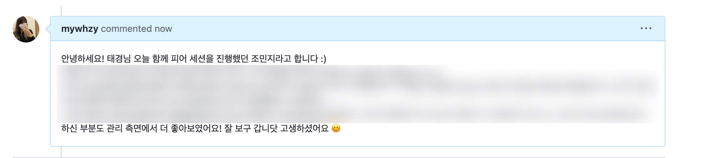
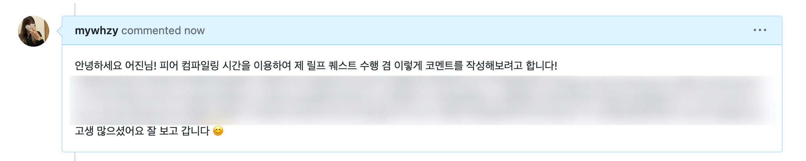

## Quest

### 매일 스터디원의 gist에 comment로 칭찬 1번

1. K013\_김준서
   > 선정 이유:
2. J063\_김준서
   > 선정 이유:
3. J237\_조민지

   > 선정 이유: 피어 세션 중 피어 컴파일링 시간 내에선 동료의 코드를 집중해서 보고 의도를 분석하기엔 시간이 부족하다고 느꼈다. 그래서 gist로 comment를 남기면서 다시 동료의 학습 저장소를 살펴보고 좋은 포인트는 나에게 흡수하고 싶다는 마음에 해당 퀘스트를 선정하게 되었다.

   미션에 대한 내용이 담긴 부분은 보이지 않게 처리했으며, 이번주는 각 두 가지의 미션으로 진행했기에 총 두 번의 코멘트를 작성해보았습니다.
   피어 세션 중 인상 깊었던 부분을 더 주의깊게 살펴보고 이헤 대해 이야기하는 형태로 진행했습니다.

   
   

### 일일 회고 작성하기

4. S009\_김기영
   > 선정 이유:
5. J116\_박주영
   > 선정 이유:
6. J164\_유영재
   > 선정 이유: 성찰은 언제나 좋은 것.
