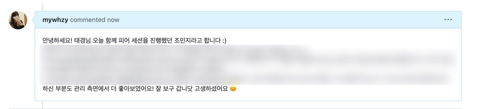
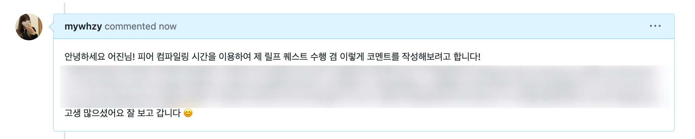

## Quest

### 매일 스터디원의 gist에 comment로 칭찬 1번

1. K013\_김준서
   > 선정 이유:
2. J063\_김준서
   > 선정 이유: 피어 세션을 통해서만 이야기를 나누면 상대방에 대한 칭찬이 휘발될 수 있다. 그래서 미션마다 좋았던 점을 기록해서 남기고자 했다.
3. J237\_조민지

   > 선정 이유: 피어 세션 중 피어 컴파일링 시간 내에선 동료의 코드를 집중해서 보고 의도를 분석하기엔 시간이 부족하다고 느꼈다. 그래서 gist로 comment를 남기면서 다시 동료의 학습 저장소를 살펴보고 좋은 포인트는 나에게 흡수하고 싶다는 마음에 해당 퀘스트를 선정하게 되었다.

   미션에 대한 내용이 담긴 부분은 보이지 않게 처리했으며, 이번주는 각 두 가지의 미션으로 진행했기에 총 두 번의 코멘트를 작성해보았습니다.
   피어 세션 중 인상 깊었던 부분을 더 주의깊게 살펴보고 이헤 대해 이야기하는 형태로 진행했습니다.

   
   

### 일일 회고 작성하기

4. S009\_김기영
   > 선정 이유: 매일매일 과제를 하다보면 스스로를 돌아볼 기회가 없어서 일일 회고 작성하기로 선정했다.
   - 회고 링크: https://defiant-crime-b26.notion.site/e3e4fb43576b41999c68a74f0e5c24cf?pvs=4
5. J116\_박주영
   > 선정 이유: 매일 회고하면서 더 나아질 수 있을 것이라고 기대함
   - 매일 무엇을 하는 것 자체가 어렵다고 느꼈다.
매일 회고를 남기지는 못했지만 이번 주에는 개선하기에서 많은 시간을 투자하면서 느낀 점이 많았다.
개선할 사항을 내가 정하고 시간 안에 모두 해결할 수 있는 가에 대한 고민을 많이 했다. 개선 사항을 좀 더 세분화하여 나의 리소스를 파악하고 데드라인을 맞추는 것도 굉장히 중요한 사항이라는 것을 다시금 느꼈다.
6. J164\_유영재
   > 선정 이유: 성찰은 언제나 좋은 것.
   * 1일차 => 오늘은 정말 어려웠다. 12시까지 헤매다가 깨달음을 얻고 진행했지만 1단계까지밖에 못했다.
   * 2일차 => 오늘은 비교적 수월한 것 같다. 개선을 같이한다는것도 신기했고 좋은 하루였다.
   * 3일차 => 오늘은 짝 프로그래밍을 했는데, 늦게까지했지만 같이 으쌰으쌰하면서 해서 외롭진않았던 것 같다.
   * 4일차 => 오늘도 2일차처럼 괜찮은 하루였고, 어제 못한 학습정리를 했다. 근데 더 해야 할 것 같다. 깊이가 부족하다.
